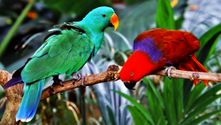
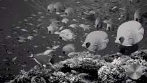
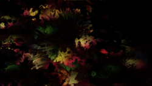
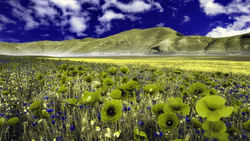
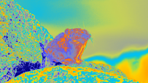
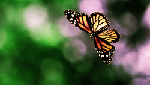

Animal Vision Simulator
==============

This is an Android application for real time animal vision simulation.
Visit **[Animal Vision Simulator](http://mmichal.com/pages/Animal_Vision_Simulator.html)** to reed more about the app.

# Introduction

In last several millions of years’ human kind has evolved from eukaryotic cells into what it is today. One of the greatest achievements of the evolution is often underestimated the sense of vision. It is interesting to observe how various environments influenced evolution to create such a variety of vision systems in different animal species. Here, you will experience extraordinary world of animal vision. **[Download the apk](https://github.com/mmichal9/Animal_Vision_Simulator/tree/master/apk/Animal_Vision_Simulator.apk)** to have a try.

# Sources of inspiration

The latest data predicts 7.77 million of different animal species living on the earth today. It is thrilling how many of them we have not even discovered yet and how little we know about those that we can see every day. It is clear, however, how crucial it proves to be for an animal to have shaped, over millions of years of evolution, such a tool as vision. For most of us, it is extremely hard to imagine a life without the ability to see. But do we ever wonder how our everyday life would look like without it? Do we ever think how it would be not to see? Or how amazing is the idea of being able to see like an animal? 

The idea behind Animal Vision Simulator is to create a user-friendly, robust and efficient mobile application which will be available to general public at anytime and anywhere. 
Application is strongly based on the **[CameraFilter](https://github.com/nekocode/CameraFilter)** project. 

# Animal Vision

Over a century ago, J. Lubbock and K. von Frisch discovered that some of the animals can see colours. Since then, major steps have been done to understand animal visual system anatomy and colour perception 
The idea about Animal Vision Research web page came with the realisation that some of the animals have such an extraordinary sense of vision that is simply impossible to completely simulate it, even when cutting-edge technology applied. The best example of an animal with such an extraordinary sense of vision is a bee. A bee has compound eyes with an ability to see ultraviolet light. It is simply impossible to fully understand the perception of this colour, since humans are not able to perceive ultraviolet light. Animal Vision Research web page focuses on chosen animals from the perspective of their visual perception.
Visit **[Animal Vision Simulator](http://mmichal.com/pages/Animal_resources.html)** to reed more about Animal Vision.

# Filters

Some of the implemented filters:

|  |  |  |  |
|:-:|:-:|:-:|:-:|
|  |  |  |  |
| [Edge Detection](https://www.shadertoy.com/) | [Edge Detection](https://www.shadertoy.com/) | [Edge Detection](https://www.shadertoy.com/) | [Edge Detection](https://www.shadertoy.com/) |
|  |  |  |  |
| [Edge Detection](https://www.shadertoy.com/) | [Edge Detection](https://www.shadertoy.com/) | [Edge Detection](https://www.shadertoy.com/) | [Edge Detection](https://www.shadertoy.com/) |
